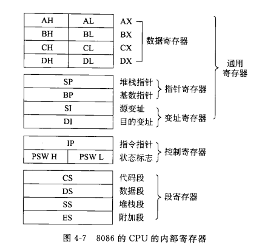
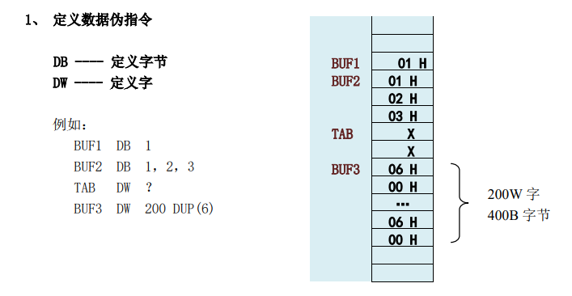

[TOC]
<font face = "Consolas">

# Unit4
## 指令系统
### CISC
复杂指令系统计算机(Complex Instruction Set Computer) 
### RISC
精简指令系统计算机(Reduced)

## 指令格式

## 寻址方式
>8086
### 寄存器

* 数据寄存器 AX-->DX
    >16位,可分为8+8(HL)
* 指针寄存器 SP,BP
    > SP堆栈指针寄存器,BP基指针寄存器
* 变址寄存器 SI,DI
    > SI源变址寄存器,DI目的变址寄存器
* 控制寄存器 IP,PSW
    * 指令指针寄存器 IP
        > CS*16+IP指向所要取指令的地址
    * 程序状态字 PSW
        > 16位,保存CPU的工作状态
* 段寄存器 CS,DS,SS,ES
    > CS代码段寄存器,DS数据段,SS堆栈段,ES附加段

### 寻址方式
#### 总结
表中均为将地址的值赋给AX
注意目的为AX还是AL(如为AL只需穿该地址的值,如为AX则还需一起传递下一个地址的值)
> 如MOV AL, [SI] 后AL = 01H
MOV AX, [SI]后 AX = 0201H

 x | y
-|-
`MOV AX, DS:[2000H]` | DS*16(左移4位)+2000H
`MOV AX, [BX]` | DS*16+寄存器(BX,SI,DI)
`MOV AX, [BP]` | SS*16+BP(BP)
`MOV AX, DISP[SI]` | 同上+DISP
`MOV AX, [BX][SI]` | 相应段寄存器*16+SI+BX
`MOV AX, DISP[BX][SI]` | 同上+DISP
#### 不允许:
不能直接在存储单元间MOV,要用寄存器中介
目的不能为CS,IP,立即数
段寄存器为目的时,源不能是立即数和其他段寄存器(要中介)

#### 立即寻址
`MOV AX,8000H`
>(8位(HL)或16位(X)立即数)
#### 直接寻址
`MOV AX,DS:[2000H]`
为 (DS*16(左移4位)+2000H) 的值
>给出段内偏移地址
#### 寄存器寻址
`MOV DS,AX`
#### 寄存器间接寻址
* 以BX,SI,DI
    `MOV AX,[BX]`
    为 (DS*16+寄存器) 的值
    >(存储于X中时,地址只指向一个字节(给AL),还需取下一个地址的字节给AH)
* 以 BP
    `MOV AX,[BP]`
     为 (SS*16+BP) 的值
    >操作方法同上
* 段超越 (给出的段寄存器不是默认的)
    `MOV AX, ES:[SI]`
    本应为DS,本题给定ES
#### 寄存器相对寻址
`MOV AX, DISP[SI]`
为 $相应段寄存器^{(见上文)}*16 + SI + DISP$
#### 基址变址寻址
`MOV AX, [BX][SI]`
为 相应段寄存器*16+SI+BX
> BX,BP为基址寄存器 SI,DI为变址寄存器
#### 基址变址相对寻址
`MOV AX, DISP[BX][SI]`
为 相应寄存器+SI+BX+DISP
****
## 指令
### 传送
#### MOV D,S  S->D
S(源)写入D(目的)
> 
#### SCHG D,S  D<->S
#### LEA S,D  D地址偏移量->S(16位)
#### PUSH Q
> Q为16位,不能是立即数
#### POP Q
> Q不能为CS
> SS:SP指向栈顶,向下增长(低地址)
### ADD
>影响标志位 AF、 CF、 OF、 PF、 SF、ZF(INC 不影响 CF)。
#### ADD OPRD1,OPRD2 ;(add)
>(OPRD1)＋(OPRD2) → (OPRD1)
####  ADC OPRD1,OPRD2 ;(进位加法))
>(OPRD1)＋(OPRD2)＋CF  → (OPRD1)
#### INC OPRD ;(++i)
>(OPRD)＋1  → (OPRD)

### SUB
#### SUB OPRD1,OPRD2 ;(subtract)
> (OPRD1)-(OPRD2) →(OPRD1)
#### SBB OPRD1,OPRD2 ;(进位减法)
> (OPRD1)-(OPRD2)- CF  →(OPRD1)
#### DEC OPRD ; (--i)
> (OPRD)-1  → (OPRD)
#### NEG OPRD ; (求补)
>  FFFFH -(OPRD)+1  → (OPRD)
#### CMP OPRD1,OPRD2 ;(比较)
> 功OPRD1)-(OPRD2)

### MUL 存入DX,AX
#### MUL OPRD ;(无符号乘)
> 若 OPRD 为字节,(AL)*(OPRD) → (AX)
 若 OPRD 为字, (AX)*(OPRD) → (DX、AX)
#### IMUL OPRD ;(符号乘)
>若 OPRD 为字节,(AL)*(OPRD) → (AX)
 若 OPRD 为字, (AX)*(OPRD) → (DX、AX)

### DIV
#### DIV OPRD ;(无符号除)
>若 OPRD 为字节, (AX)÷(OPRD)
商  → (AL)
 余数  → (AH)
 若 OPRD 为字, (DX,AX)÷(OPRD)
 商  → (AX)
 余数  → (DX)
#### IDIV OPRD ;(符号除)
>同上

### 逻辑
#### NOT OPRD  按位取反
>NOT(OPRD)  → (OPRD)
####  AND OPRD1,OPRD2 按位与
>(OPRD1)AND(OPRD2) → (OPRD1)
####  OR OPRD1,OPRD2 按位或
>(OPRD1)OR (OPRD2) → (OPRD1)
####  XOR OPRD1,OPRD2 按位异或
>(OPRD1)XOR(OPRD2) → (OPRD1)
####  TEST OPRD1,OPRD2 按位与,结果不保存
>(OPRD1)AND(OPRD2)

### 移位
>OPRD 为通用寄存器 或 内存操作数。
 m 为立即数 1 或 CL,决定移位次数。

####   SAL/SHL OPRD,m ;算术左移/逻辑左移
####  SAR/SHR OPRD,m ;算术右移/逻辑右移

### 循环移位
>同上
OPRD 为通用寄存器 或 内存操作数。
m 为立即数 1 或 CL,决定循环移位次数。
####  ROL/ROR OPRD,m ;左/右循环移位
#### 指令 RCL/RCR OPRD,m ;带进位左/右循环移位

### 串操作
> 对某个连续的内存区中的每个字或字节均作同样的操作(BIN数,BCD码,ASCII码)
 DS:SI 源串
 ES:DI 目的串
 CX 计数器
 AL/AX 累加器
 DF 方向标志,DF=0,+1/2; DF=1,-1/2
#### MOVS 串传送指令
> MOVS DST,SRC ; SRC 源串, DST 目的串
 MOVSB ; 字节传送
 MOVSW ; 字传送

>(DS:SI)→ (ES:DI)
 (SI)± 1/2 → (SI)
 (DI)± 1/2 → (DI)

#### REP 串指令前缀
 REP MOVS
 REP STOS
 REP LODS
> 重复串指令执行,重复次数为(CX)

<details>
<summary><mark>例</summary>
1000H:0100H 为首地址,长度为 1000 字节的串,传送到 2000H:0000H 开始的串。

 MOV AX,1000H
 MOV DS,AX
 MOV SI,0100H ; 设置源串 DS:SI = 1000H:0100H
 MOV AX,2000H
 MOV ES,AX
 MOV DI,0000H ; 设置目的串 ES:DI = 2000H:0000H
 MOV CX,1000  ; 设置计数器
 CLD           ; 设置方向标志 DF=0
 REP MOVSB     ; 开始
 
</details>

### 程序控制
>转移类指令通过改变 CS 与 IP 的值或仅改变 IP 的值,以改变指令执行的顺序。
#### JMP OPRD 无条件跳转
>该指令分直接转移和间接转移两种。
其中,直接转移又可分 短程(SHORT)、近程(NEAR) 和 远程(FAR) 三种形式。
⚫ 短程转移 JMP SHORT OPRD ; IP = IP + 8 位位移量,段内转移
⚫ 近程转移 JMP NEAR OPRD ; IP = IP + 16 位位移量,段内转移
⚫ 远程转移 JMP FAR OPRD ; CS、IP 均改变,段间转移
#### 条件转移
>测试上一条指令所设置的某些标志位的状态作为,条件满足则指向目的地址
只能为短程

(1) 以单个标志位为条件
* `JO OPRD` ; OF=1,溢出
* `JNO OPRD` ; OF=0,不溢出
* `JS OPRD` ; SF=1,结果为负
* `JNS OPRD` ; SF=0,结果为正
* `JC OPRD` ; CF=1,进位
* `JNC OPRD` ; CF=0,无进位
* `JE／JZ OPRD` ; ZF=1,==0
* `JNE／JNZ OPRD` ; ZF=0,!=0
> 与各标志位对应,N表示为相反

(2) 无符号数比较
* `JA／JNBE OPRD` ; >
* `JAE／JNB OPRD` ; >=
* `JB／JNAE OPRD` ; <
* `JBE／JNA OPRD` ; <=
> A为大于,B为小于,N为相反,E为bool等于(如已有等于则删去等于)


(3) 带符号数比较
* `JG／JNLE OPRD` ; >
* `JGE／JNL OPRD` ; >=
* `JL／JNGE OPRD` ; <
* `JLE／JNG OPRD` ; <=
> G为大于,L为小于,N为相反,E为bool等于(如已有等于则删去等于)

> 如:
CMP DL,AL ; DL-AL
 JAE NEXT ; 若 DL>=AL(无符号数),跳转到NEXT (等价于 JNC)

#### LOOP
`LOOP OPRD` ; CX≠0 循环,
相当于:
```
DEC CX
JNZ OPRD
```

### 处理器控制
#### 标志位操作
 STC 、CLC、CMC ; CF （ Set, CLear, Complement）
 STD 、CLD ; DF
 STI 、CLI ; IF
#### 外部同步
 HLT ; 暂停指令
 NOP ; 空操作指令
 WAIT ; 等待指令

 ### 输入输出
 > I/O 寻址: [35H],[DX],不同于内存寻址。
 采用直接寻址仅限于接口地址的前 256 个（0～FFH）
当接口地址≥256 时,必须采用 DX 间接寻址
#### IN ACC, PORT 
> 从接口到 CPU 的输入
#### OUT PORT,ACC 
> 从 CPU 到接口的输出
****
## 汇编程序
### 语句格式
`[标号] 指令助记符 [操作数] ;注解`
如`NEXT: MOV AL,[SI] ;读(DS:SI)内存数据`
### 伪指令
> 对汇编程序进行控制,以实现对程序中的数据实现条件转移、列表、存储空间分配等处理。
一般不产生目的代码,即不直接命令 CPU 去执行什么操作
#### 定义数据伪指令 (地址赋值)

#### 符号定义伪指令 EQU (定义变量)
```
 NUM EQU 200
 BUF3 DW NUM DUP(6)
```
#### 定义过程的伪指令 PROC 和 ENDP
>可将具有一定功能的程序段定义为一个过程,过程由伪指令 PROC 和 ENDP 来定义
```
过程名 PROC [ NEAR/FAR 类型] ；近过程/远过程 
 ┆ 过程体 
 RET 
 过程名 ENDP 
```
#### 段定义伪指令 SEGMENT 和 ENDS
> 将源程序划分成若干段。通常,一个完整的汇编源程序由3个段组成,即
堆栈段、数据段和代码段。
```
段名 SEGMENT 
 ┆ 段体 
段名 ENDS
```
#### 汇编结束伪指令 END
`END [表达式] `
如`END START`

### 运算符
#### 取值运算符 SEG 和 OFFSET
SEG取段地址, OFFSET取偏移量
```
TAB: 2000H:0100H
MOV AX, SEG TAB ;AX = 2000H
MOV AX, OFFSET TAB ;AX = 0100H
```
#### 属性运算符 PTR (类型转换)
```
MOV [BX],BYTE PTR TAB ;字节传送,19H
MOV [BX],WORD PTR TAB ;字传送,0019H
```

### 程序结构
* 标准结构:
```
STACK SEGMENT 
 ┆  ;定义栈段中数据(无需变量名的数据伪指令)
STACK ENDS 
DATA SEGMENT
 ┆  ;定义数据段变量(需要变量名的数据/符号定义伪指令)
DATA ENDS 
CODE SEGMENT 
MAIN PROC FAR 
START:
 ┆
 ┆
    RET (过程体MAIN最后一句)
MAIN ENDP (过程体MAIN结束)
CODE ENDS (CODE段结束)
END START (汇编结束)
```