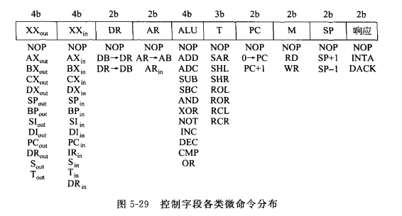

[TOC]
<font face = "Consolas">


# CPU设计

## CPU功能
> 指令控制 操作控制 时间控制 数据加工 中断处理 其他处理
## CPU组成部件图

* AX-DX: 通用数据寄存器
* BX,BP: 基址寄存器
* SI,DI: 变址寄存器
* SP: 堆栈指针
* ALU: 算术逻辑单元
* T,S: 两个16位暂存器,T可以移位和循环操作
* PC: 程序计数器
* IR: 指令寄存器, 存放正在执行指令
* PSW: 程序状态字
* AR: 单向地址寄存器
* DR: 双向地址寄存器

## 时序系统
将各种控制信号严格定时，在时间上相互配合完成某一功能
时序周期通常分为3级: 指令周期,机器周期,时钟周期
### 同步控制:
指令执行或指令中每个控制信号都由事先确定的统一的时序信号进行统一控制
### 异步控制: 
当控制器发出某一操作控制信号后，等待执行部件完成操作后发回“回答”信号，再开始新的操作
>没有统一的时钟对信号进行同步
 每条指令的指令周期可由多少不等的机器周期数组成
### 联合控制
同步控制和异步控制相结合的方式
>大部分微操作序列安排在固定的机器周期中，对某些时间难以确定的操作则采用“应答”方式

## 指令设计格式


## 指令执行
> 有三个步骤: 取指令操作码,取操作数,执行指令
### 取指令
```
PC->AR      //存储PC
AR->MEMadr  //读取PC中的内容

RD,PC+1->PC  //发出读指令读取PC内容即指令,取下一PC

MM->DB      //PC内容写入总线DB//MM->DB->DR->IR
DB->DR      //DB写入双向地址寄存器DR
DR-IR       //将指令放到指令寄存器
```

### 译码


### 取操作数
#### 双操作数指令

`RD为读信号`
`要取内容就要过存储器,不需要取就直接入暂存器`
```
ADD BX,[DI]
bit[3]-bit[0]为0111可知为DI的寄存器间接寻址
bit[7]-bit[4]为1001可知目的寄存器为BX
将DI的内容通过存储器放到暂存器S中
```
```
MOV AX,4000H   //MOV译码和执行同时完成,即取操作数阶段即可结束
bit[3]为1可知为立即寻址
bit[7]-bit[4]为1000可知目的为AX
由PC内容作为地址读出立即数4000H,PC加一,将立即数放入AX
```

#### 单操作数指令

```
INC [BX]   //对BX内容(当作地址)的内容+1
bit[7]-bit[4]可知为INC
bit[2]-bit[0]为101可知为以BX为目标的寄存器间接寻址
BX定位的存储器的内容送入暂存器S
```
```
SHR CX      //逻辑右移
bit[3]-bit[0]可知为对CX的寄存器寻址指令
CX送入暂存器S
```

#### 无操作数指令
`bit[3]-bit[0]确定为哪条无操作数指令 `

### 执行指令
#### 转移指令
```
                //取操作数后偏移量已放到暂存器S,且加到ALU的一端
PC->ALU         //将当前PC(当前指令地址)放到ALU另一端
ADD->T          //ALU两端相加,得到偏移地址放到暂存器T
T->PC           //更新PC为新的偏移地址
```
#### 双操作数指令
```
ADD BX,[DI]:    //取操作数后一个操作数[DI]已放到暂存器S中,且加到ALU一端
BX->ALU         //将BX内容加到ALU另一端
ADD->T          //ALU两端相加,得到结果放到暂存器T
T->BX           //结果送入BX
```
#### 单操作数指令
```
INC [BX]:       //已将[BX]放到暂存器S中,且加到ALU一端
ALU中S+1->T     //+1,放到暂存器T
BX->MEMadr      //将BX内容(解释为地址)放入地址寄存器(可省略,因取操作数阶段地址寄存器已存放该地址直到指令执行结束)
T->DB,WR        //将结果放入数据总线DB上,给出写控制信号WR,将结果写回存储单元
```
```
SHR CX:         //已将CX内容放到暂存器S,且加到ALU一端
ALU直通->T
T逻辑右移
T->CX
```


## 微操作命令
> 微操作命令提供控制信号实现微操作
`PC->AR`是微操作 $PC_{out},AR_{in}$是微命令
### 取指令码周期FIC
`W0-W3为节拍信号,P0-P3为触发脉冲`
>W0  $PC_{out},AR_{in}$     //$PC_{out}$可直接用W0加到PC的输出三态门实现.$AR_{in}$可用触发脉冲P0实现
 W1 $AR->AB,RD,PC+1$ 
 W2 MM->DB,$DR_{in}$
 W3 $DR_{out},IR_{in}$
//结束后判别有无DMA请求或DMA传送结束
### 取操作数周期FDC
> MOV AX,4000H
w0  $PC_{out},AR_{in}$     //将PC送入单向地址寄存器AR
w1  $AR→AB,RD,PC+1$        //AR送入总线AB,给出读信号,PC+1
w2  $MM→DB,DR_{in}$        //存储器读出PC地址的内容(4000H),送入双向地址寄存器DR
w3  $DR_{out},AX_{in}$     //DR将4000H送入AX,完成MOV操作

> ADD BX,[DI]
W0 $DI_{out},AR_{in}$       //DI的值送入单向地址寄存器AR
W1 $AR→AB,RD$               //AR送入总线AB,给出读信号
W2 $MM→DB,DR_{in}$          //存储器读出DI的值送入总线DB,双向地址寄存器DR读入该值
W3 $DR_{out},S_{in}$        //DR将DI的值送入暂存器S
### 执行周期EXEC
>ADD BX,[DI]                //[DI]已放到暂存器S中
W0 $S→ALU$                  //将[DI]送入ALU一端
W1 $BX→ALU$                 //将BX送入ALU另一端
W2 $ADD, ALU→T,T_{in}$      //发出ADD命令,将ALU结果发送给暂存器T
W3 $T_{out},BX_{in}$        //T将结果发送给BX

## 微程序控制器
> 依据微程序顺序产生一条指令执行时所需的全部控制信号.

>微命令: 控制信号
微操作: 控制信号控制执行的操作
微指令: 一组微命令的组合（完成一定的操作功能）
微程序: 完成一条机器指令的一系列微指令的序列
控制存储器: 存放微程序的存储器
### 微程序控制器结构

* CM: 只读ROM,存放所有指令的微程序
* uAR: 存放现行微地址
* uIR: 存放现行微指令

### 后继地址
有三种可能:
    1. 微程序首地址: 由指令寄存器确定
    2. 下一调顺序地址: PC+1
    3. 分支跳转地址
> 2,3情况都有两地址格式,单地址格式,可变格式
#### 两地址格式

地址1,2分别提供下条命令的顺序地址和跳转地址
通过地址选择控制位AC和CPU状态标志产生地址选择信号,通知多路选择器选择三种地址之一送入uAR
#### 单地址格式

引入uPC,通过其+1能力产生下条顺序微地址
地址字段提供下条跳转地址,下条顺序地址由uPC+1获得
#### 可变格式

绝大部分时间为顺序执行,所以让微指令在顺序执行时只提供控制信号生成,分支时再提供跳转地址
a只用于形成微命令,b只用于微程序分支转移
用指令标志位S决定用哪个微指令
#### 多分支地址

将指令的操作码作为ROM1的地址,指令寻址部分及状态信号作为ROM2地址,结合在一起构成这条指令微程序的首地址

### 微指令控制域编码
> 由该控制域将微指令翻译成微命令
#### 水平型微指令
> 多个控制信号同时有效,多个微操作同时发生
##### 直接表示法

将n个微命令记为n位控制域字段
> 但每条微指令所需的微命令较少,浪费太多
##### 字段译码法
> 互斥的信号放在同一字段,相容的信号放在不同字段
  字段内垂直编码，字段间水平编码


>每个字段中要设计一个无效控制信号的编码

>字段组织的有效方法：
按功能组织：把功能类同的各控制信号放在同一字段中
按资源组织：把加载到同一部件上的各控制信号放在同一字段
#### 垂直型微指令
> 利用微操作码的不同编码来表示不同的微操作功能(类似机器指令)

由微指令操作码和微操作对象组成
* 微指令操作码: 只是做何种微操作
* 微指令对象: 提供微操作所需的操作数(地址或常量)
#### 区别:
* 水平型徽指令:
    * 需要较长的徽指令控制域
    * 可以表示高度并行的控制信号
    * 对控制域提供的控制信息只需较少的译码电路,甚至不需要译码
* 垂直型徽指令:
    * 需要较短的徽指令控制域
    * 并行徽操作的表示能力有限
    * 对控制信息必须译码

### 微指令设计

> NA微地址编码,由CM大小决定有几位,AC微后继地址控制字段
一条微命令共9+4+27=40位



### 微程序编程

