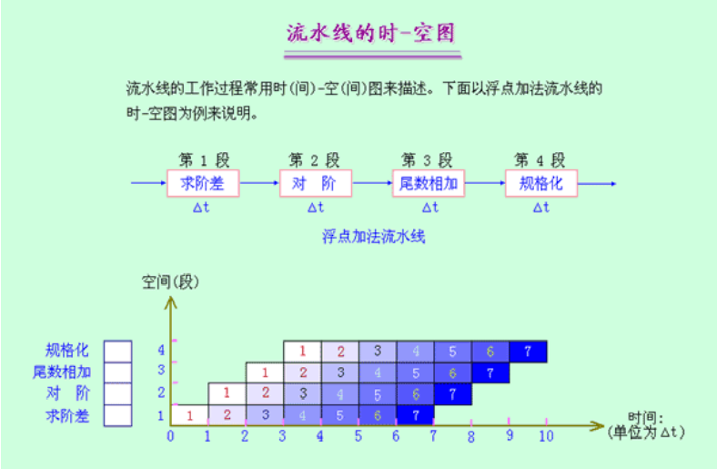
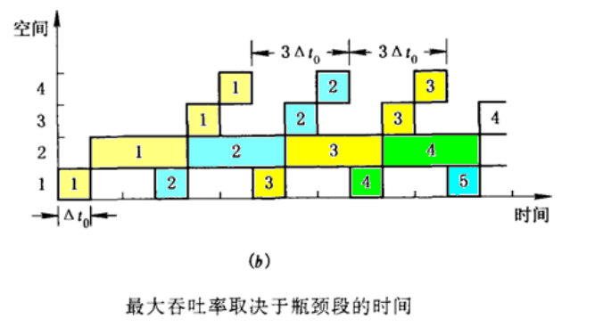
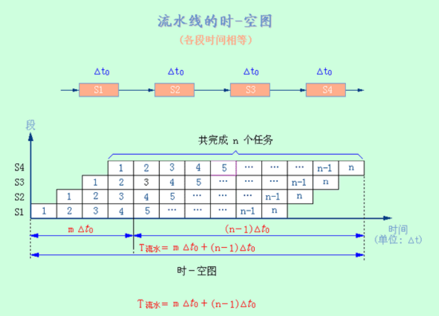
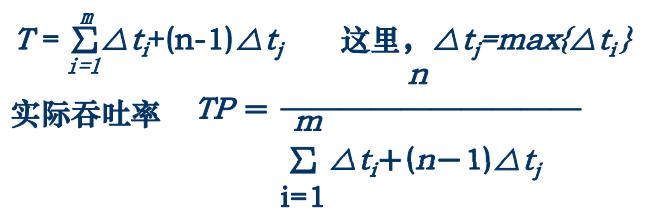
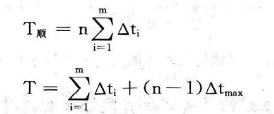

流水线技术
[TOC]

# 时空图

# 分类
## 单功能/多功能流水线
>按流水线所完成的功能分类
* 单功能流水线: 只能完成一种固定功能的流水线
* 多功能流水线: 各段可以进行不同的连接,从而完成不同的功能
## 静态/动态流水线 
>按同一时间内流水段的连接方式划分                                                 
* 静态流水线: 是指在同一时间内,流水线的各段只能按同一种功能的连接方式工作
* 动态流水线: 是指在同一时间内,当某些段正在实现某种运算时,另一些段却在实现另一种运算
## 部件级/处理机级/处理机间流水线
>按流水的级别划分
* 部件级流水线: 又叫运算操作流水线，是把处理机的算术逻辑部件分段，使得各种数据类型的操作能够进行流水。
* 处理机级流水线: 又叫指令流水线，是把解释指令的过程按照流水方式处理。
* 处理机间流水线: 又叫宏流水线，是由两个以上的处理机串行地对同一数据流进行处理，每个处理机完成一项任务
## 线性/非线性流水线
>是否有反馈回路来进行分类
* 线性流水线: 流水线的各段串行连接，没有反馈回路。
* 非线性流水线: 流水线中除有串行连接的通路外，还有反馈回路
## 顺序流动/乱序流动流水线
>按照输出端任务流出顺序与输入端任务流入顺序是否相同划分
* 顺序流动流水线: 是指流水线输出端任务流出的顺序与输入端任务流入的顺序相同。
* 乱序流动流水线: 也可称为无序流水线、错序流水线，是指流水线输出端任务流出的顺序与输入端任务流入的顺序不一定相同。

# 性能分析
## 吞吐率TP
单位时间内流水线所完成的任务数或输出结果的数量
* 最大吞吐率$TP_{max}$: 流水线在达到稳定状态后所得到的吞吐率
    * 流水线各段的时间相等，均为$△_{t0}$，则:
    $TP_{max} = 1/△_{t0}$
    * 流水线各段时间不等，第i段时间为$△_{ti}$ ，则:
    $TP_{max} = 1/max\{△_{ti}\}$
        >瓶颈为流水线中最慢的一段
        消除瓶颈的方法:细分瓶颈段 重复设置瓶颈段
        
* 实际吞吐率$TP$: 设流水线由m段组成，完成n个任务的吞吐率

    * 各段时间相等为$△_{t0}$:
    $TP = n/T_{流水}$, $T_{流水} = m△_{t0} + (n-1)△_{t0}$
    n为执行指令总数,$T_{流水}$为总时间
    * 各段时间不等:
    
    >$TP ＜ TP_{max}$
    当n >> m 时，$TP ≈ TP_{max}$
## 加速比S
$S=T_{非流水}/T{流水}$
执行n条指令,流水线为m段:
* 各段相等为$△_{t0}$:
$T_{非流水}=mn△_{t0}$ $T_{流水}=m△_{t0}+(n-1)△_{t0}$
* 各段不等:

## 效率E
流水线的设备利用率
E=n个任务占用的时空区/m个段总的时空区
$E=n△_{t0}/T_{流水}$

# 相关
后一条指令因与前一条指令存在某种关联不能在原先指定的时钟周期开始执行
## 类型
## 结构相关
发生硬件资源冲突
> 解决:
插入暂停周期
设置相互独立的指令存储器和数据存储器
>> 完全避免成本很高,为降低成本减少延迟允许部分存在
## 数据相关
指令取值用到前指令操作的部分,无法重叠执行
* 写后读(RAW) j在i完成写之前从R中读出数据
* 写后写(WAW) j在i之前完成写操作
* 读后写(WAR) j先将数据写入R
> 解决:
插入暂停周期
直通(forwarding)技术:解决写读相关
增加流水线互锁(pipeline interlock)硬件
利用编译器
## 控制相关
 遇到改变PC的指令(分支指令等)