存储系统
[TOC]

# 分类
* 按存储信息介质分
    >a. 半导体存储器
    b. 磁存储器
    c. 激光存储器
* 按与CPU的关系分
    >a. 主存储器MM；
    b. 控制存储器CM
    c. 高速存储器Cache
    d. 外存储器
* 按读写功能分
    >a. 随机存储器(读写存储器)RAM
    ---- SRAM、DRAM
    >b. 只读存储器ROM 
    ---- ROM、PROM、EPROM、EEPROM(FM)
    RAM断电后状态消失,ROM可一直保存

# 性能指标
* 容量
* 存储器速度: 存取周期、存取时间
    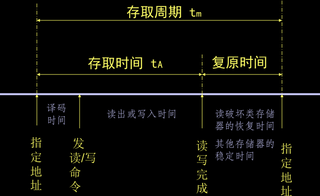
* 可靠性
* 成本

# 内部存储器(主存)
## RAM(随机读写存储器)
### SRAM(静态随机读写存储器)
常规RAM芯片外部有地址引线 数据引线 控制信号引线
* 地址引线
负责选中相应的存储单元,n条地址引线可表示$2^{n}$种地址编码,最多有$2^{n}$个存储单元
    * 译码: 一维译码/二维译码
    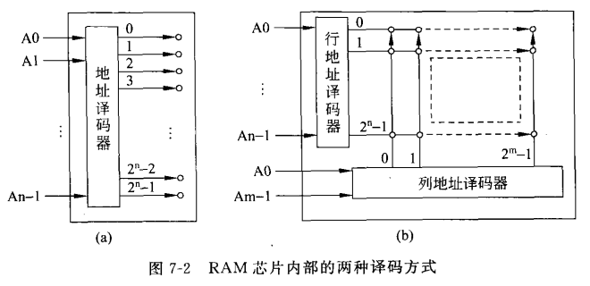
        > 二维译码主要是简化译码器的设计(大容量会使译码器很复杂)
* 单元电路
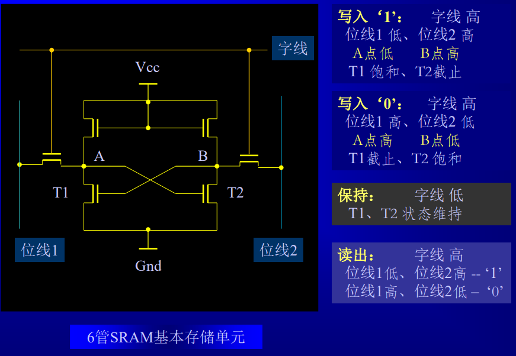
### 主存的组成及接口
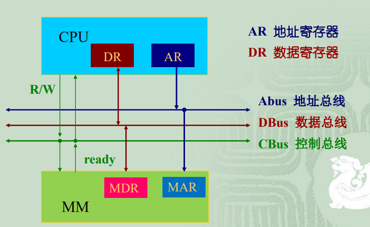
#### 存储器和CPU的协调
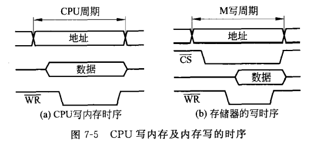
CPU写内存的周期: CPU送出内存地址,数据,写控制信号WR
这些信号加到系统总线送到内存芯片
> 提高信号的持续时间必须大于等于内存芯片要求的信号时间
#### 内存构成
* 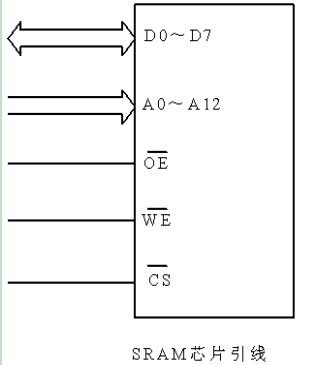
* A0-A12: 13条地址信号线 决定有多少个存储单元
* D0-D7: 8条双向数据线 决定每个存储单元存储多少给二进制位
* CS: 片选信号的引线 当片选信号同时有效(CS=0)时,才能选中该芯片。
* OE: 输出允许信号 只有OE有效(OE=0)时才允许该芯片将某单元的数据送到芯片外部的D0～D7上
* WE: WE是写允许信号 WE=0,允许写入;WE=1,允许读出。
> 写入: 在A0-A12加上写入单元的地址,在D0-D7加上写入的数据,修改信号位(CS=0,WE=0) >> 读出的信号位(CS=0,WE=1,OE=0)
* 连接使用
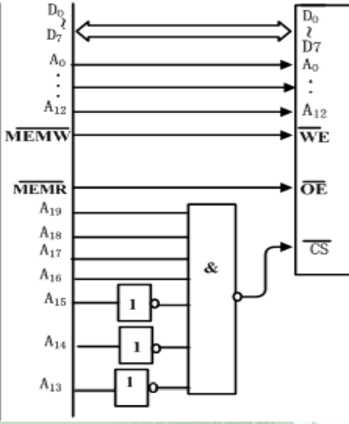
    > 芯片占用内存地址范围
    CS=0时选中,所以芯片占据的空间就是CS=0时A19-A0的取值,即A19-A13为1111000,A12-A0任意,占据F000H-F1FFFH共8K内存空间
#### 扩展
* 字扩展
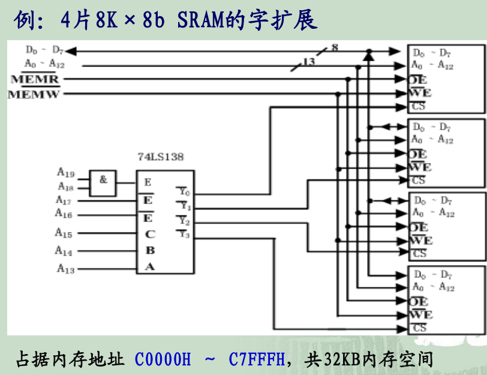
    > 通过译码器选择不同的片
* 位扩展
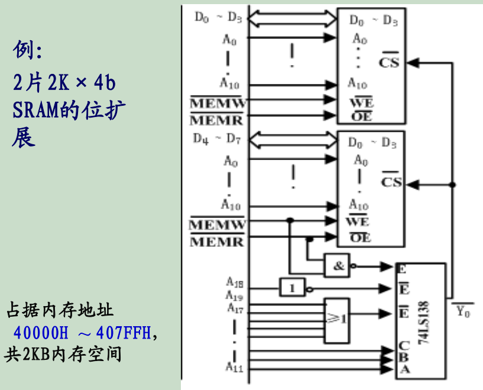
    > 分别接D

* 内存检测
>例：2片2K×4b SRAM的位扩展,占据 40000H ～ 407FFH,
共2KB内存空间 ,编程对该内存进行检测。
分析：对内存单元 40000H 的检测
MOV AX, 4000H
MOV DS, AX
MOV SI, 0000H ; 初始化 DS : SI 为内存地址40000H
MOV [SI], 55H ; 将 55H 写入40000H内存单元
MOV AL, [SI] ; 读出 40000H内存单元的内容
CMP AL, 55H ; 将读出值与55H进行比较
JNE ERROR ; 比较结果不相等,则为出错
#### 8086中内存的连接
8086是16位处理器(D0-D15),为实现可一次访问一个字或一个字节,将地址空间分为偶存储体和奇存储体(地址为偶数或奇数)
所以引线上增加了BHE信号
A0=1,BHE=0奇地址字节; A0=0,BHE=1偶地址字节; A0=0,BHE=0字
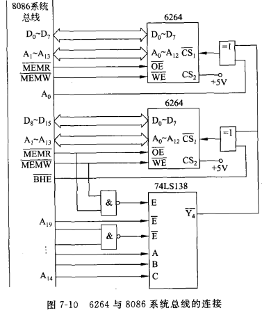
> 地址范围为70000H-73FFFH
规则字的低字节在偶地址单元,高字节在奇地址单元
### DRAM(动态读写存储器)
#### 引线
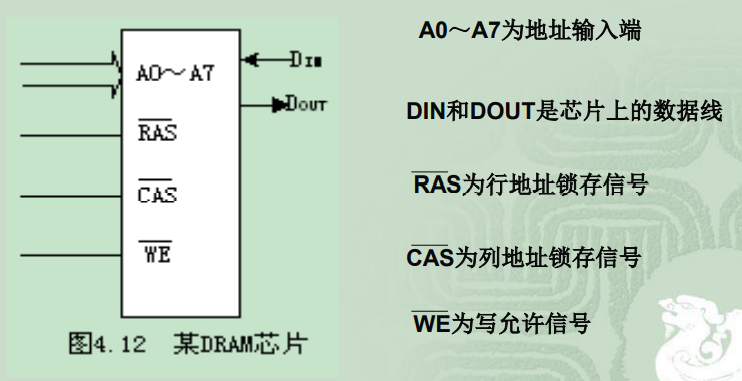
> 读取过程:
CPU将行地址加到A0-A7,给出RAS锁存信号将行地址锁存在芯片内部.然后列地址加到A0-A7,送出CAS锁存信号.一直保持WE=1,在CAS有效期间数据输出
写入过程: 锁存过程相同,WE=0加上写入数据
(将WE=0放在CAS=0之前是提前写,保证芯片一直处于写状态.若We=0放在CAS=0之后芯片先处于读状态后变为写状态,可以依次完成读和写,称为读变写操作周期)
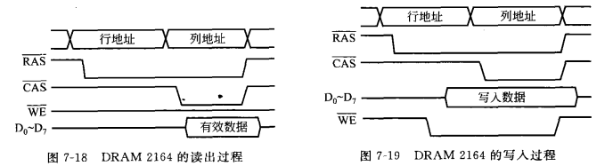
刷新周期:
动态RAM存储的信息必须定期进行刷新,通常DRAM要求2-4ms刷新一次
送出行地址,RAS=0将行地址锁存,CAS=1就对这行所有列进行刷新.顺序送出所有行地址就可以刷新所有存储单元
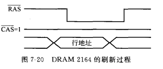
#### SRAM和DRAM对比
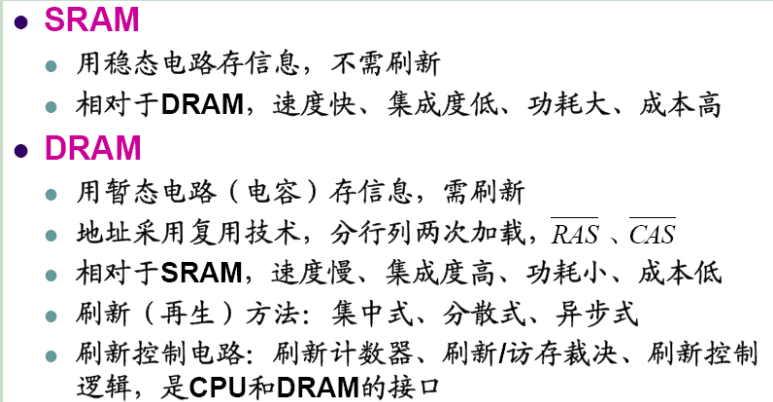
## ROM(只读存储器)(非易失性半导体存储器)
### 分类
1. 只读存储器ROM：掩膜ROM
2. 一次性编程只读存储器PROM
3. 可擦可编程只读存储器EPROM
4. 电可擦可编程只读存储器E²PROM
5. 快擦除读写存储器（Flash Memory)： 闪存
### EPROM 2764
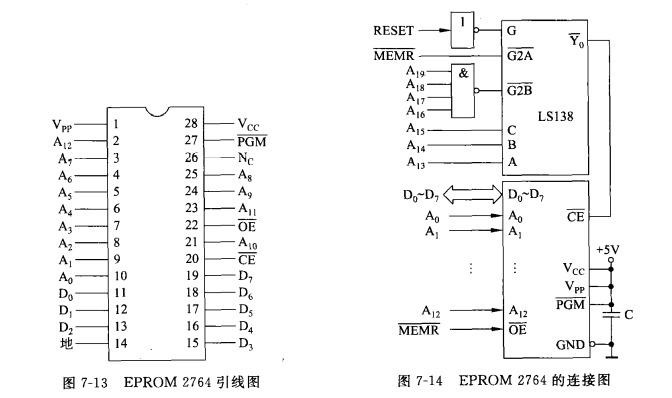
> 13条A,容量8K 8条D,每个存储单元存放一个字节
* CE: 片选信号,0有效
* OE: 输出允许信号,0有效
* PGM: 编程脉冲输入端,编程时加入编程脉冲,读数据时为1
> 地址范围F0000H-F1FFFH

# 高速缓冲存储器(cache)
> 通过高速cache缓解CPU速度提高与存储器速度性价比的矛盾
## 工作原理
### 程序的局部性原理
时间局部性(短期重复访问) 空间局部性(临近访问)
### 位置
cache在CPU和主存之间,存放当前正在执行的程序和正在访问的数据,程序运行时直接从cache中取数据
### 构成
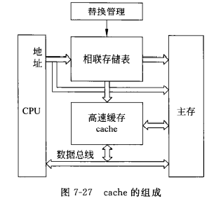
> CPU请求数据时,从地址线将地址加到主存也加到相联存储表,如相联存储表检索到cache中有此数据(命中),就将该地址转换为cache地址读出信息,未命中则CPU用主存读周期从主存中读出数据,将这块信息替换cache中的一块
## 地址映射
主存地址到cache地址的映射
> 主存地址分为主存块号和块内地址(块内地址又分为cache块号和块内地址)
### 全相联方式
* 将cache和主存分为容量相等的块,cache和主存的块分别给出块号
>主存的任何一块都可装入cache的任何一块
* 存放主存块号的相联存储器有cache块数个单元,记录装入cache的主存块号
* 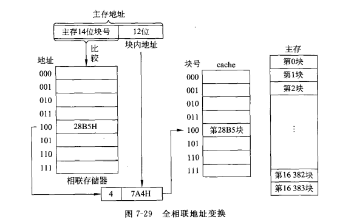
> 优点: 装入cache灵活
缺点: 代价高(要求相联存储器容量大,检索相联存储器时需遍历)
### 直接映射方式
* 将主存以cache的容量分区,每个区再分块
> 主存各区中块号相同的块只能装入与cache中相同的块号中(cache以块号存储,主存块号与cache块号一致)
* 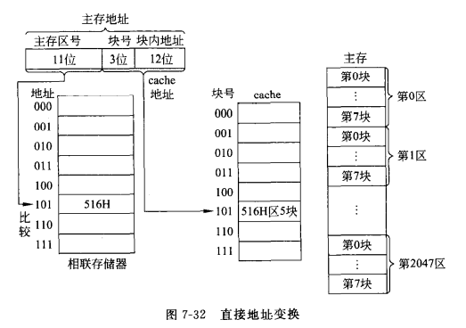
> 先比较相应块号中存储的区号和主存地址的区号,命中则块号和块内地址为cache地址
优点: 地址变换简单
缺点: 效率低(交替访问)适合大容量cache
### 组相联方式
*  组间直接,组内全相连: 主存以cache容量分区,区内按cache方法分组,组内再分块
> 主存区内某组只能装入cache同号组,组内块可以装入同组号任意块
* 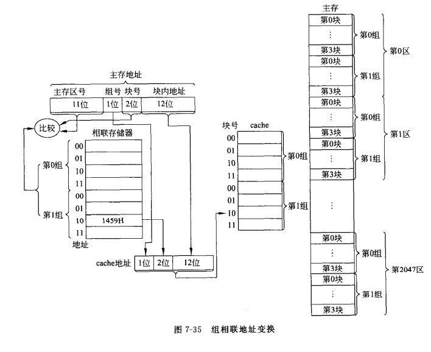
> 通过组号确定相联存储器的组,然后在该组中遍历匹配主存区号和组内块号构成的检索字,发现匹配字的地址结合组号和块内地址得到cache地址
## 替换算法
### 随机替换算法(RAND)
随机函数产生替换的块号
> 没考虑信息历史和使用情况,命中率低,已淘汰
### 先进先出算法(FIFO)
最先装入的替换
> 只考虑历史情况没考虑使用情况,命中率不高
### 近期最少使用算法(LRU)
每块设置计数器,命中时将其计数器置0其他块加1.替换时将计数器最大的块替换
### 最不经常使用算法(LFU)
每块设置计数器,调入时置0,访问一次加1.替换时将计数值最小的块替换,并将所有计数器清零
> 在替换周期中计数,不能完全反映近期访问情况
### 最优替换算法(OTP)
理论最优
## 主存-cache内容一致性
cache是主存内容的复制,但CPU对cache写后要反馈到主存中
### 写回法(write back)
* 写cache命中:数据写入cache后不立即写入主存,只有修改块替换时再写入主存
* 写cache未命中: 将相应主存块调入cache后在cache中修改,该块替换后写入主存
> 存在不一致性隐患
cache必须配修改位
### 全写法(写直达法 write through)
修改时用时修改cache(命中的话)和主存
> 一致性
cache对CPU向主存的写无高速缓冲功能
## cache性能分析
### 命中率H
$H=N_c/(N_c+N_m)$
> $N_c$:cache完成存取总次数 $N_m$:主存完成存取的总次数
### 加速比$S_p$
$S_p=T_M/T$
> $T_M$: 主存访问周期 $T$: cache平均访问时间
$T=H*cache访问周期+(1-H)*未命中访问周期$

# 虚拟存储器(Virtual Memory)
* 虚拟存储技术:
是在主存与辅存之间,增加软件及必要的硬件,使主、辅存之间的信息交换、程序的再定位、地址的转换都能自动进行、使两者形成一个有机的整体.
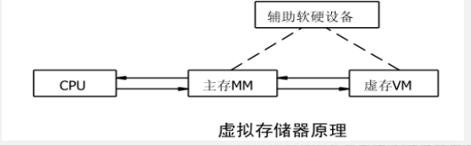
## cache-主存 对比 主存-辅存
* 共同点:
用的地址变换映射方法和替换策略的思想是相同的，都基于程序局部性原理
    遵循的原则都是：
    * 把程序中最近常用的部分驻留在高速的存储器中。
    * 一旦这部分变得不常用了，把它们送回到低速的存储器中。
    * 这种换入换出是由硬件或操作系统完成的，对用户是透明的。
    * 力图使存储系统的性能接近高速存储器，价格接近低速存储器。
* 区别:
    * 目的: cache主要解决主存与 CPU的速度差异问题;而辅存主要是解决存储容量的问题
    * 数据通路: CPU与cache和主存之间均有直接访问通路,cache不命中时可直接访问主存;而辅存与CPU之间不存在直接的数据通路,当主存不命中时只能通过调页解决,CPU最终还是要访问主存。
    * 透明性: cache的管理完全由硬件完成,对系统程序和应用程序均透明;而虚存管理由软件(操作系统)和硬件共同完成,对系统程序不透明,对应用程序透明(段式和段页式管理对应用程序“半透明”)
    * 未命中损失: 由于主存的存取时间是 cache 的5~10倍,而辅存的存取时间通常是主存的上千倍,故虚存未命中时系统的性能损失罗远大于 cache未命中时的损失。