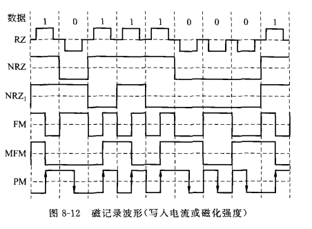
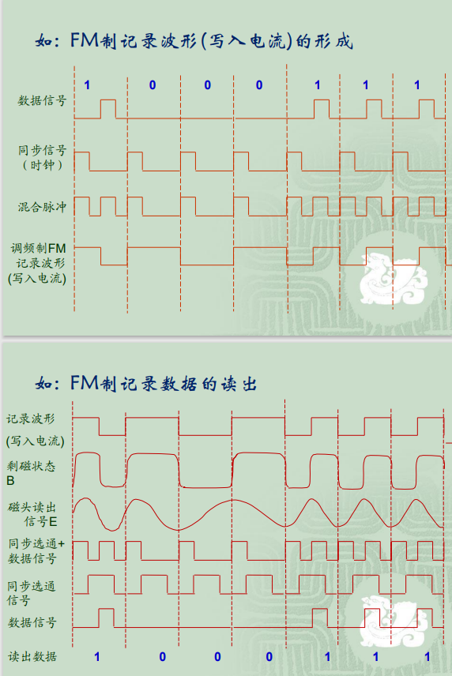
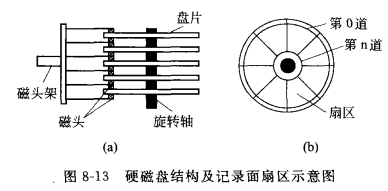
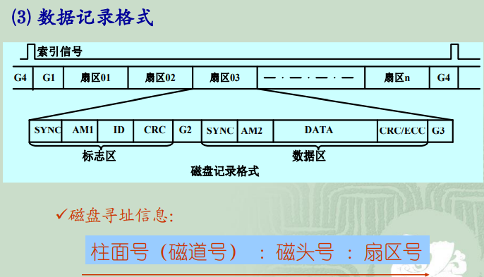
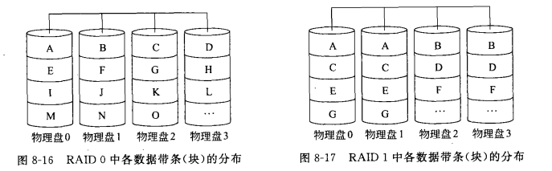
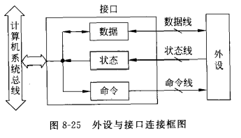

输入输出系统
[TOC]

# 总线
## 定义
计算机系统多个功能部件之间进行数据传送的公共通路
## 分类
一般分类:
* 片内总线
* 元件级总线（板内总线）
* 内总线（系统总线）
* 外总线（通信总线）

单处理器系统:
* CPU内部总线
* 系统总线
* I/O总线
## 性能描述
### 带宽
总线的最大数据传输率(每秒传输字节数)
### 宽度
总线线数(地址线宽度,数据线宽度)
### 负载
连接在总线上的最大设备数量
### 频率
> 带宽 = 数据线宽度 * 总线频率
$B=\frac{n}{8T}=\frac{n*f}{8}$
>>B总线带宽 f时钟频率 n数据位
## 信息传送方式
### 串行/并行传送
* 串行传送: 各位利用一条数据线依次传输
* 并行传送: 各位利用多条数据线同时传输
### 同步/异步传送
通信双方的时间配合或控制,称为总线定时(一种协议,规则)
* 同步总线: 收发双方公用的时钟和固定的协议,双方频率保持一致,每一位数据保持同步
    > 成本较高
* 异步传送: 使用握手协议,无需严格同步
    > 需要费时进行同步和帧格式检测
## 总线仲裁
当多个设备提出占用总线的请求时，以某种方式选择其中一个设备占用总线

# 输入输出基本原理
## 外部存储器
### 磁存储器
利用硬磁材料的剩余磁状态保存二进制信息
#### 磁记录方式
按照某种规则将二进制信息变换为磁记录层上磁场变化的方法

有正,负电流脉冲和归零
* 归零制(RZ):写入时0负1正,两位之间归零
* 不归零制(NRZ):连续0或连续1时不变,01变时改变
* 见一就变不归零制(NRZ1): 见到1就改变方向,见到0不变
* 调频制(FM): 每位改变一次,1在中间改变一次
* 改进调频制(MFM):1在中间改变一次,连续>=2个0时每位改变一次,单个0不变
* 调相制(PM):用不同电流方向表示01(图中正方向1反方向0)
> 自同步能力: 能直接从磁表面记录中读出信息并获得二进制码元同步信号(NRZ,NRZ1无自同步能力)
R = 最小磁化翻转间隔 / 最大磁化翻转间隔
编码效率(记录密度)η = 位密度 / 最大磁化翻转密度

#### 硬磁盘存储器
##### 分类
* 磁头的工作方式
固定磁头、移动磁头
* 盘片可换与否
固定盘存储器、可换盘存储器

##### 组成 
由驱动器和控制器组成

##### 数据记录格式

##### 主要技术指标
* 存储密度：道密度和位密度
    * 道密度：沿磁盘半径方向单位长度上的磁道数。
    * 位密度：沿磁道圆周方向单位长度上所能记录的二进制位数
* 存储容量
    * 非格式化容量：位密度×内圈磁道周长×磁道总数
    * 格式化容量： 扇区容量×每道扇区数×磁道总数
* 平均寻址时间
    * 寻道时间： 与磁头径向移动速度有关
    * 旋转等待时间：与磁盘旋转速度有关
* 转速
    指硬盘内驱动电机主轴的旋转速度，单位为RPM(转/分
    钟).目前IDE硬盘的主轴转速一般为5400/7200RPM。
    SCSI硬盘主轴转速可达7200RPM~10000RPM，最高可
    达15000RPM
* 数据传输率
    数据传输率(B/s) ：扇区内字节数×每道扇区数×磁盘转速
##### 磁盘阵列RAID
组合磁盘的方式
* RAID0
可热插拔磁盘,不提供错误校验
数据分成带条(物理的数据块或扇区),将各带条分布记录在各磁盘驱动器上,每个带条无校验,无冗余存储
    >多硬盘可同时读写,读写速度最快,但任一磁盘驱动器损坏可能使RAID失效

> RAID0 有利于并行处理相邻数据块
* RAID1
数据同时放到2个盘上,两盘互为镜像
    > 高可靠性,利用率低,硬件复杂
* 并行海明纠错阵列(RAID2)
海明码记录在单独的盘上
* 奇偶校验并行位交错阵列(RAID3)
校验码记录在单独的盘上
* 奇偶校验扇区交错阵列(RAID4)
* 循环奇偶校验阵列(RAID5)
* 二维奇偶校验阵列(RAID6) 和RAID7

## 程序控制输入/输出
I/O系统：外部设备 + 设备控制器
> 设备控制器（接口）的功能:传递数据、设备选择、设备控制、信号形式转换、速度匹配、数据缓存、错误检测、负载匹配、支持中断等。
对于某些复杂的外设,I/O接口还应是具有“智能”的控制器
### 外设编址
外设地址与内存地址
* 地址统一编址
    可使用内存指令,但两种指令不易区分
* 独立编址
    有区别的指令
### 外设接口模型
接口实现了CPU和外设间的数据交换

* 数据信息: 数字量(二进制编码信息),开关量(一位二进制,表状态),模拟量(连续信息,需转换为二进制编码)
* 状态信息: 外设所处的状态(BUSY,READY等)
* 控制信息: CPU发出控制外设工作的信号
### 输入输出接口类型
按信息传送的方式分：
* 并行接口、串行接口
* 同步方式、异步方式

按数据传送的控制方式分(控制外设进行数据传送的调度策略)：
* 程序直接控制方式
* 中断方式
* 直接存储器存取（DMA）方式
* 通道控制方式与外围处理机方式

### 程序控制IO方式
* 无条件传送方式
    CPU可仅通过IO指令与外设交换数据
    实现简单: 硬件上提供CPU与外设连接的数据端口,软件上提供相应IO指令
* 查询传送方式
    CPU指令询问外设工作状态,根据状态对其IO
    多外设时根据优先级轮询
    CPU效率低,无法实时响应(轮询结束后才可得知紧急事件)
* 中断方式
* DMA(直接存储器读取)方式
* 通道方式
