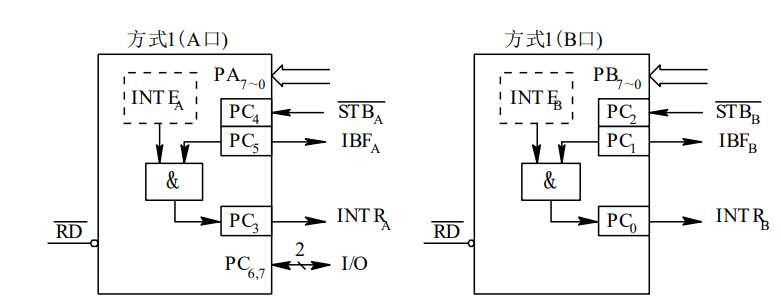
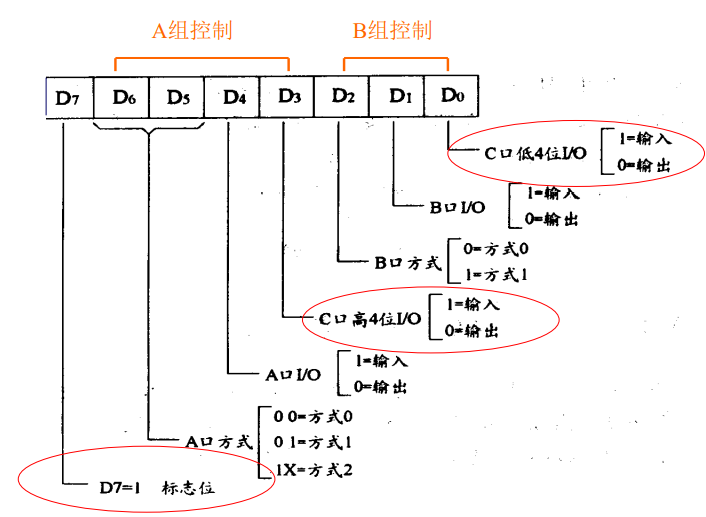

中断
[TOC]
<font face = "Consolas">

# 中断
中断请求->中断响应->中断处理->中断返回
> 是指某事件的发生引起CPU暂停当前程序的运行,转入对所发生事件的处理,处理结束又回到原程序被打断处接着执行这样一个过程。
```text
中断源:引起中断的事件（内部错误、外设请求等）.
```

## 中断过程
以外部可屏蔽中断(**INTR**)为例
## 中断请求 
外部设备要求CPU对其服务,就产生一个有效的中断请求信号(电平信号或边沿信号).加到CPU中断请求输入端,即提出中断请求
> 问题: 
电平类中断请求信号：
有效中断请求必须保持直到被CPU发现
CPU响应后,应及时撤除中断请求信号
边沿类中断请求信号：
中断请求信号的锁存和撤消
## 中断承认
CPU在指令执行的最后一个时钟周期检测中断请求输入端,决定是否给出响应.
>响应INTR需满足的条件:
1.CPU允许中断(开中断 IF=1)
2.无更高优先级指令(复位RESET,保持HOLD,非屏蔽中断请求NMI)
3.无特殊指令(开中断指令STI,中断返回指令IRET,还需执行另外一条指令才能响应INTR)
## 中断源识别
多个中断通过一条中断请求线向CPU提出请求
* 软件查询法: 输入接口读入多个中断源状态,逐个查询
* 中断向量法: 每个中断源对应唯一的向量码(中断服务程序的入口地址),中断请求得到响应时CPU硬件产生该中断的中断向量自动转向该中断的服务程序
## 断点保护
>分为两部分:
CPU硬件自动完成
中断服务程序中由指令完成
* 断点信息 —— 断点地址、断点状态
* 断点保护 —— 保护断点信息
    >PSW、CS、IP 压栈(CPU硬件自动完成)
    其它寄存器(AX、BX … ) 压栈(ISR完成)
* 断点恢复 —— 恢复断点信息
    >IP、CS、PSW 弹栈(CPU硬件自动完成)
    其它寄存器(AX、BX … )弹栈(ISR完成)
## 中断优先级
* 优先响应高优先级:
    不同优先级的中断源同时提出中断请求先响应最高优先级的中断源
    优先级高的中断源是否可以中断优先级低的中断服务程序
    > 有两种处理方式: 不允许中断中断服务,允许
    >> 产生中断嵌套(多级中断,多重中断)
> 目前采用的中断优先级控制方案有：
1、软件查询
2、利用可编程中断控制器(PIC)
3、硬件链式优先级排队电路
4、硬件优先级编码比较电路

# 8086中断系统
## 资源/概念
可容纳256个中断源,每个中断源用一个字节型编码标识(中断向量码)
中断源分为: 内部中断,外部中断
* 内部中断：由CPU内部事件及执行软中断指令产生。
    >已定义的内部中断有：
    除法错中断
    单步中断 ( TF=1 ) 
    断点中断 ( INT 3 ) 
    溢出中断 ( INTO ) 
    软件中断
* 外部中断：外部中断源产生对CPU的请求而引发的。
    > 8086(88)中断系统将外部中断源又分为2种：
    >>非屏蔽中断 NMI
    用于电源错、内存或总线错等
    >>可屏蔽中断 INTR 
    用于一般的输入\输出等

    >MI与INTR的主要不同为：
    请求有效形式不同：NMI为上升边有效;INTR为高电平有效。
    NMI不受IF的影响;INTR只有在IF＝1时才可能得到响应。
    NMI的优先级比INTR高。
    中断向量码不同：NMI由CPU内部产生,为02H;INTR由外部硬件设定

## 中断响应过程
* 中断源查询

* 中断响应过程


## 中断向量表
1kb内存作为中断向量表,4字节一组共256组,按中断向量码序号排列

> 中断服务程序入口地址、中断向量(CS:IP)
>例：软中断 INT 4AH 的执行过程
✓ CPU取出INT 4AH指令,经指令译码获知这是一条中断指令。并且得到4AH就是该软件中断的中断向量码。
✓ 将F、CS和IP压入堆栈保护起来,并关中断。
✓ 将中断向量码4AH乘4得到中断向量表地址128H,128H、129H两个单元的内容送IP, 12AH、12BH下两个单元的内容送CS。这就转向了中断服务程序。
在此之前,中断服务程序的入口地址早已填入中断向量表中

# 中断控制器8259
## 内部结构

* D0-D7: 双向数据线,与系统总线数据线相连,传输中断向量码到CPU
* WR/RD: 写/读控制信号,与总线写/读信号相连
* CS: 片选信号,低有效
* A0: 8259内部寄存器选择信号,通常接地址总线A1或A0
* INT: 中断请求输出信号,可连CPU的INTR输入端
* INTA: 中断响应输入信号,CPU中断响应信号到8259
* CAS0-CAS2: 双向级联控制线,多片级联工作时主控芯片的CAS作为输出链接到各从属芯片.从属提出中断请求时主控送出相应编码使从属中断被允许
* SP/EN: 缓冲模式时输出,非缓冲模式输入.SP=1为主控,SP=0为从属
* IR0-IR7: 中断请求输入端
>状态寄存器:
* 中断请求寄存器IRR: 
8位寄存器保存外部中断源IR0-IR7的等待响应的中断请求信号,灭以为对应一个中断源,有请求$IRR_X=1$得到相应0
* 中断屏蔽寄存器IMR：
8位寄存器每一位对应一个外部中断源的屏蔽$IMR_X=1$/开放0
* 中断服务寄存器ISR：
8位寄存器保存正在被服务的中断源,IR正在被服务则ISR对应位1
## 工作方式
### 工作模式
* 8080/85模式(8位机)
* 8086/88模式(16位机)
### 中断优先级管理方式
* 一般全嵌套方式(固定优先级)：IR0到IR7依次降低
* 自动循环优先级：刚结束服务的中断源优先级最低
* 特殊循环优先级：程序指定一个最低优先级,下一个优先级最高并以此降低,自动循环
* 特殊全嵌套方式: 允许并行同级中断请求的全嵌套方式(用于级联方式工作)
### 屏蔽方式
进行优先级控制
* 一般屏蔽方式(ISR实现低级屏蔽): 响应时使ISR相应位置1,优先级判决电路禁止所有<=的中断请求
* 特殊屏蔽方式(允许低级嵌套到高级): 利用OCW3设置,再利用OCW1将当前服务中断加以屏蔽,使ISR当前中断对应位清0,从而使所有未被OCW1屏蔽的中断源有可能得到响应
### 中断结束方式
* 自动结束方式: 只有一片且不会中断嵌套时
    中断响应的第二个INTA负脉冲清除ISR中的相应位,从而中断结束(此时终端服务程序未执行,所以不允许中断嵌套)
* 一般结束方式: 用在一般全嵌套方式下
    CPU发送结束命令(EOI)给8259,时ISR优先级最高的置1位清零,结束中断(利用OCW2高3位001实现)
* 特殊结束方式: 非一般全嵌套下,无法利用ISR置1位确定处理的是哪级中断
    特殊结束命令(SEOI)结束指定的那一级中断(OCW2高3位011,低3位指定要结束的中断源)
### 中断触发方式
到IRx
* 电平触发：高电平,维持到中断响应第一个INTA负脉冲结束前,及时撤销
* 边沿触发：上升沿,高电平维持到中断响应(第一个INTA脉冲结束)
### 中断向量号
操作命令字OCW


# DMA(直接存贮器存取方式)
* 无条件传送、查询传送、中断传送这几种方式都是通过CPU执行程序实现的,占用了CPU资源,传送速度慢
* DMA以纯硬件控制的方式进行的,CPU不参与
* DMA方式下内存和外设之间直接通过DMAC通信
## DMA方法
### 周期挪用
CPU执行内部CPU指令时不需要总线的控制也不访问内存
利用CPU未使用总线的时间由DMAC窃取一个总线周期的总线控制权进行数据传输,然后立即将控制权还给CPU
### 停止CPU
1. 外设向DMAC发出DMA请求DREQ;
2. DMAC将此请求传递到CPU的总线保持端HOLD,向CPU提出DMA请求;
3. CPU完成当前总线周期后立即对DMA请求作出相应：
    * 一是CPU将地址总线、数据总线、控制总线置高阻,弃对总线的控制权;
    * 二是CPU送出有效的总线响应信号HLDA加载至DMAC,之可以使用总线;
4. DMAC向外设送出DMA应答信号DACK,同时占用总线,开始对总线实施控制;
5. DMAC送出内存地址和对内存与外设的控制信号,控制外设与内存或内存与内存之间的数据传送;
6. DMAC通过计数控制将预定的数据传送完后,向CPU发出无效的HOLD信号,撤消对CPU的DMA请求;
7. CPU收到此信号后,送出无效的HLDA,并重新开始控制总线,实现正常的总线控制操作
### 与中断区别
区别 |中断方式| DMA方式
-|-|-
请求对象 |程序控制权 |总线使用权
响应时刻 |指令周期结束 |CPU周期结束
CPU的作用 |全程控制,硬件控制逻辑和中断处理程序的结合 |仅参与DMA的启动和结束
处理异常的能力| 具有处理异常能力 |仅进行数据传送
现场的保护 |需要保护CPU现场 |不会改变现场
优先级 |比DMA低 |比中断高
外设与主存的连接方式| 需经过CPU |数据通路直接连接

## DMA控制器8237
8237工作有两种周期: 空闲周期和工作周期.
### 传输方式:
1. 单字节传输方式 ：在单字节传输方式下,DMA控制器每次请求总线只传送一个字节数据,传送完后即释放总线控制权。
2. 块传输方式（也称组传输方式）：块传输方式是指DMA控制器每次请求总线连续传送一个数据块,待整个数据块全部传送完成后再释放总线控制权。
3. 请求传输方式：逐字节传输,但持续检测DMA请求信号是否依旧有效

# 通道方式
通道是一个特殊功能的处理器(称为IO通道处理机、IO通道控制器),专门负责传输控制,硬磁CPU只负责数据处理,这样通道和CPU分时使用内存,CPU内部运算和IO设备平行工作

> 具有两种类型的总线: 
1.存储总线,它承担通道与内存、CPU与内存之间的数据传输任务．
2.通道总线(I/O总线),它承担外围设备与通道之间的数据传送任务．
这两类总线可以分别按照各自的时序同时进行工作．
IO系统有4级连接:
CPU与内存<-->通道<-->设备控制器<-->外围设备
## 类型
* 选择通道
* 数组多路通道
* 字节多路通道

# 可编程并行接口8255
8位通用可编程并行输入输出接口芯片
## 结构


三个八位IO端口(ABC)按组编程
* A组: 端口A + 端口C高4位PC0~PC3
* B组：端口B + 端口C低4位PC4~PC7

* D0~D7: 双向数据线
* RD: 读控制,通常接系统总线IOW或WR
* CS: 片选,低允许读写,通常接高位地址译码输出
* A0,A1: 地址选择信号线(选择ABC口)

* RESET: 低正常,高复位.(复位后ABC口为输入状态)
* PA0~PA7: A口8条IO信号线
* PC0~PC7: 可选数据IO,控制信号O,状态信号I

## 工作方式
通过软件编程指定
### 方式0: 基本输入输出
* ABC口24条线均为数据IO线
* A,B,C高4,C低4均可指定输入或输出
* ABC输出均有锁存能力,输入都没有
* 可对C口按位操作
> 适用于简单的输入输出操作
### 方式1: 选通输入输出
* AB口工作,C引线作为信号
* 通常以中断方式工作
* AB可指定输入/输出
* AB输入输出均有锁存
1. AB输出
    
    * OBF: 输出缓冲器满信号,低有效
    (告诉外设CPU已在规定口上输出一个有效数据)
    * ACK: 外设响应信号,低有效
    (告诉接口外设已将数据接收,并置OBF=1)
    * INTR: 中断请求信号,高有效
    (外设收到数据后通知CPU数据已被接收,可输出下个数据)
    * INTE: 中断允许状态
    (为高才可能产生有效INTR)
    > 除去信号用到的C线,其余C线还可指定数据传送IO
2. AB输入
    
    * STB: 输入选通信号,低有效
    * IBF: 输入缓冲器满信号,高有效
    * INTR: 中断请求信号,高有效
    * INTE: 为中断允许状态
### 方式2: 双向选通输入输出
只有A口有双向IO方式,用到C的5条线,B可工作在方式或0,C剩余线可用IO或作为B方式1控制线
A口线既向外设输出数据,又从外设输入数据
    
控制信号功能相同
* A既为输入也为输出,ACK有效则PA0~PA7输出;ACK无效则不打开
* A输入输出均锁存,均可产生中断

## 控制字,状态字
### 控制字
8位二进制
* bit[7]=1时,控制AB组
    
* bit[7]=0时,仅对C口进行位操作
    
## 寻址,连接使用
8255占4个外设编址(A,B,C口,控制寄存器)
* 寻址信号:
    
* 连接系统总线:
    
    * 8255由A9\~A0这10条地址线决定其地址,所占地址为380H~383H
### 初始化
控制字写入控制寄存器(CR),指定工作方式,数据传送方向
输出外设控制信号
* 打印机
```
初始化
MOV DX,0383H           ;接口地址默认380H-383H
MOV AL,10000011B       ;控制字1,控制AB组
OUT DX,AL
MOV AL,00001101B       ;控制字0,C口位操作
OUT DX,AL
```


# 可编程定时器8253
## 引线


左接系统总线,右为3个完全一样的定时/计数器(减法器)
>每个计数器可按二进制或BCD码计数;
每个计数器的计数速率可达2MHZ;
每个计数器有六种工作方式,可由程序设置和改变;
全部输入输出都与TTL电平兼容
* CLK: 外部计数时钟输入
    (每一时钟周期可对定时/计数器内部16位计数器-1)
* GATE: 门控信号
    (0禁止计数,1允许工作)
* OUT: 输出信号
    (计数到0输出一信号)
* A0~A1: 编码选择信号
    A0A1 | 选择
    -|-
    00 | 计数器0
    01 | 计数器1
    10 | 计数器2
    11 | 控制寄存器
* CS: 片选,低有效
* RD: 读控制信号,低有效
* WR: 写控制信号,低有效
* D0~D7: 双向数据总线
## 寻址


## 工作方式


* 0计数结束中断: GATE=1,每时钟计数器-1.GATE=0计数停止
* 1可编程单稳: GATE上升沿启动计数,同时OUT输出低电平维持到计数器=0
    > 输出一个负脉冲,由GATE上升沿开始,持续整个计数周期
* 2频率发生器: GATE高进行分频,计数器=1OUT输出一时钟周期负脉冲,GATE低强制OUT高
    > OUT连续输出一时钟周期的负脉冲,间隔为计数器初值
* 3方波发生器: GATE高输出对称方波,GATE低强制OUT高 
    >计数N偶前N/2计数过程OUT为高,后N/2为低;N奇前(N+1)/2为高,(N-1)/2为低,循环
* 4软件触发选通: GATE高计数
    >计数N,写入后N+1时钟周期出现负脉冲
* 5硬件触发选通: OUT输出高,GATE上升沿开始计数,计数结束OUT一周期负脉冲,过程中GATE又上升沿则重新开始
    > OUT为高,GATE上升沿开始,N时钟周期结束OUT给负脉冲
## 控制字


## 初始化 
* 计数器初始化顺序: 
    写入方式控制字
    ->写入计数值低字节
    ->写入计数值高字节
    > 多计数器先都写入方式控制字后,依次写入计数值低,高字节
```text
例
将计数器2初始化为工作方式3,计数初值为1000,为二进制计数方式设寄存器地址为400H ~ 403H
控制字
1 0 1 1 0 1 1 0 B6H
MOV DX,403H    ;控制寄存器地址
MOV AL,0B6H    ;计数器2,先低后高字节
OUT DX,AL      ;写命令字
MOV DX,402H    ;计数器2地址
MOV AX,1000    ;计数初值
OUT DX,AL      ;写计数值低位
MOV AL,AH
OUT DX,AL      ;写计数值高位
```