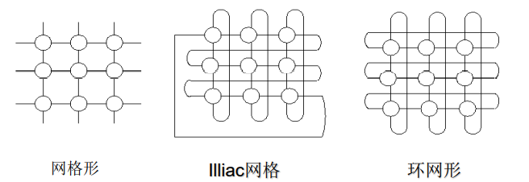

多机系统

<font face = "Consolas">
<!-- @import "[TOC]" {cmd="toc" depthFrom=1 depthTo=6 orderedList=false} -->

<!-- code_chunk_output -->

- [为何要多机系统](#为何要多机系统)
- [并行处理](#并行处理)
  - [含义](#含义)
  - [途径](#途径)
  - [计算机系统分类](#计算机系统分类)
  - [MIMD结构的并行](#mimd结构的并行)
  - [网格计算与云计算](#网格计算与云计算)
- [多机互联网络](#多机互联网络)
  - [分类](#分类)
  - [互连函数](#互连函数)
    - [表示方法](#表示方法)
    - [常用的基本互连函数](#常用的基本互连函数)
  - [静态互联网络](#静态互联网络)
    - [常见的静态互联网络](#常见的静态互联网络)
  - [动态互连网络](#动态互连网络)
    - [总线](#总线)
    - [交叉开关网络(crossbar)](#交叉开关网络crossbar)
    - [多级互联网络](#多级互联网络)
      - [2*2交换开关](#22交换开关)
    - [多级均匀洗牌网络(Omega网络,Ω网络)](#多级均匀洗牌网络omega网络ω网络)
- [当代并行机系统](#当代并行机系统)
  - [对称多处理器SMP(Symmetric MultiProcessor)](#对称多处理器smpsymmetric-multiprocessor)
    - [UMA(Uniform Memory Access)一致性存储器访问模型](#umauniform-memory-access一致性存储器访问模型)
    - [NUMA(Nonuniform Memory Access)非一致存储访问模型](#numanonuniform-memory-access非一致存储访问模型)
    - [SMP特点](#smp特点)
  - [MPP(Massively Parallel Processors)大规模并行机](#mppmassively-parallel-processors大规模并行机)
  - [集群Cluster(工作站机群COW(Cluster of Workstations))](#集群cluster工作站机群cowcluster-of-workstations)
- [并行系统性能](#并行系统性能)
  - [加速比性能定律](#加速比性能定律)
  - [Amdahl 定律](#amdahl-定律)

<!-- /code_chunk_output -->

# 为何要多机系统
并行计算机(parallel computer)
* 仅提高时钟频率难以提升计算机性能
* 电子,光子速度无法超越光速
* 晶体管尺寸不断缩小,量子力学效应,散热成主要问题

# 并行处理
## 含义
* 可同时计算: 并行性是指问题中具有可同时进行运算或操作的特性。开发并行性的目的是为了能予以并行处理,以提高解题效率

并行性包括同时性和并发性.
* 两个或多个事件在同一时刻发生属于同时性
* 在同一时间间隔内发生则属于并发性
## 途径
* 时间重叠: 流水
    >在并行性中引入时间的因素。它是让多个处理过程在时间上错开,轮流重叠地使用同一套硬件设备的各个部分,使之加快硬件使用的周转来赢得速度(流水)
* 资源重复: 重复硬件
    >在并行性中引入空间的因素。它是靠重复设置硬件资源来提高可靠性或性能的(双工系统,相联处理机,阵列处理机)
*  时间重叠与资源重复
* 资源共享: 软件方法
    >用软件方法让多个用户共用同一套资源,通过提高系统资源的利用率来提高系统的性能和效率
## 计算机系统分类
弗林（Flynn)分类法的分类:
* 单指令流单数据流
(SISD, Single Instruction Stream Single Data stream)
    > 单处理器系统,只有一个指令流和一个数据流,一个时刻只能做一件事.冯·诺伊曼计算机
* 单指令流多数据流
(SIMD, Single Instruction Stream Multiple Data stream)
    > 同一条指令被多个使用不同数据流的多处理器执行
    实现数据级的并行
* 多指令流单数据流
(MISD, Multiple Instruction Stream Single Data stream)
    > 多条指令同时在同一数据上进行操作(未商用)
* 多指令流多数据流
(MIMD, Multiple Instruction Stream Multiple Data stream)
    > 同时有多个CPU执行不同的操作
    实现线程级并行

## MIMD结构的并行
MIMD分为:
* 多处理器系统(共享存储计算机) 
    > 所有的CPU共享公共内存,所有CPU见到同一个内存映像(单一虚拟地址空间)
    只有一个操作系统副本(一个页面映射表和一个进程表)
* 多计算机系统(消息传递计算机)
    > 每个CPU有自己的私有本地内存
    处理器间或进程间利用消息传递机制通信
    实现容易,编程困难
## 网格计算与云计算
* 网格(grid): 通过Internet共享计算能力,数据和其他资源
* 云计算(cloud computing): 远程数据中心配备高性能集群,用户通过终端接入数据中心,按需进行存储,运算

# 多机互联网络
* 互联网络(interconnection network): 由开关元件按照一定的拓扑结构和控制方式构成的网络,实现计算机系统中各部件,处理器间甚至计算机间的相互连接
    > 也称通信子网(communication subnets),
    通信子系统(communication subsystems)
    多网络互联称网络互联(internetworking)
* 路由(routing): 实现信息包(packet)在互联网络上从源节点送往目的节点的机制,包括路径选择和信息传输
## 分类
* 静态互连网络（Static Interconnection Network)
各结点之间有固定的连接通路、且在运行中不能改变的网络
* 动态互连网络（Dynamic Interconnection Network)
由交叉开关构成、可按运行程序的要求动态地改变连接状态的的网络
## 互连函数
互连网络输入输出端口地址的一对一(bijection)映射

>$f (x_{n-1}…x_1x_0) = y_{n-1}y_{n-2}…y_1y_0$
`x`: 互联网络输入端口编号(地址)的n位二进制编码
`y`: 互连网络输出端口编号的n位二进制
`f()`: 互联网络输入与输出的对应关系
### 表示方法
* 函数表示法
    >见上文互连函数
* 表格表示法
    ```text
    输入端口地址  |   0    1  ...   N-1  |
    输出端口地址  |  f(0) f(1) ... f(N-1)|
    ```
* 循环表示法
    > 将有输入输出连接且编号能衔接且循环的一组连线的节点放到一括号内,如0->2,2->4,4->6,6->0有(0 2 4 6)
* 图形表示法
### 常用的基本互连函数
* 恒等置换
    > 输入输出端一一互连
* 交换置换
    >二进制编码最低位不同的输入端与输出端连接
    0-1 1-0  
    2-3 3-2  
    4-5 5-4  
    6-7 7-6
* 方体置换
    > 二进制编码第i位不同的输入端与输出端连接
    
* 均匀洗牌置换
    > 将输入端均匀分为2半,前半后半按顺序一个隔一个与输出端一次相连
* 加减$2^i$置换
    > 将输入端的编号循环加减$2^i$与输出端相连
    $PM2_{+i}(x)=(x+2^i) mod N$
    
    减$2^i$置换为向上
* 蝶形置换
    > 将输入端的二进制最高位与最低位互换
    

## 静态互联网络
静态互联网络适用直连链路,一旦构成固定不变
### 常见的静态互联网络
* 线性阵列(Linear Array)
    > 并行机中最简单、最基本的互连方式
      每个节点只与其左、右近邻相连,也叫二近邻连接
      内部节点度为2,端节点度为1
* 二维网格(2-D Mesh)
    > 每个节点只与其上、下、左、右的近邻相连(边界节点除外),节点度为4
    在垂直方向上带环绕,水平方向呈蛇状,就变成 Illiac网格,节点度恒为4
    垂直和水平方向均带环绕,则变成了环网形,节点度恒为4
    
* 树形(tree)
    > 除了根、叶节点,每个内节点只与其父节点和两个子节点相连。
    节点度为3
    如果尽量增大节点度,就变成了星形网络（Star)
* 超立方(Supercube)
    > 一个n-立方由$N=2^n$个顶点组成,4-立方由两个3-立方的对应顶点连接而成。
    n-立方的节点度为n

几种结构可以混合（嵌入）
* 全互连网络 (fully connected network)
    > 所有节点都直接相互连接
    度=N-1
    直径=1
    链路数=N(N-1)/2
    对分带宽=N/2·N/2

## 动态互连网络
设有开关电路,利用控制信号控制开关从而达到动态互联.
### 总线
最简单的互连网络

>多处理机总线系统的主要问题包括总线仲裁、中断处理、协议转换、快速同步、高速缓存一致性协议、分事务、总线桥和层次总线扩展等

### 交叉开关网络(crossbar)


### 多级互联网络
单极交叉开关级联起来形成多级互连网络MIN(Multistage Interconnection Network)
>改进: 可用小规模交叉开关模块串联,并联构成多级交叉开关网络,减少设备量
#### 2*2交换开关
最常用的二元开关


* 两个输入两个输出,交叉可达
* 输出端必须避免冲突,允许一对一,一对多映射,不允许多对一
* 4种状态: 直通through 交叉cross 上播upper broadcast 下播lower broadcast
* 可直通可交换的称为两功能开关,一位控制信号控制
  具有所有4中功能的称为四功能开关,两位控制信号控制

### 多级均匀洗牌网络(Omega网络,Ω网络)
N=8用2*2开关和均匀洗牌构成的Omega网络:


* 级数为$log_2N$

# 当代并行机系统
1. 共享存储多处理器系统
    * 对称多处理器SMP结构特性
        >包括:UMA 一致性存储器访问多处理器系统、
        NUMA 非一致性存储器访问多处理器系统
2. 分布存储多计算机系统
    * 大规模并行机MPP结构特性
3. 机群系统
    * 工作站机群COW
## 对称多处理器SMP(Symmetric MultiProcessor)
在一个系统中,每个CPU都能平等地访问所有的内存模块和输入/输出设备,而且在操作系统看来这些CPU是可以互换的
>包括:UMA类型的对称多处理器
 NUMA类型的对称多处理器
### UMA(Uniform Memory Access)一致性存储器访问模型
特点: 
* 物理存储器被所有处理器均匀共享；
* **所有处理器访问任何存储字时间相同**；
* 每台处理器可带私有高速缓存；
* 外围设备也可以一定形式共享。
### NUMA(Nonuniform Memory Access)非一致存储访问模型
特点:
* 被共享的存储器在物理上是分布在所有的处理器中的,其所有本地存储器的集合就组成了全局地址空间；
* **处理器访问存储器的时间是不一样的**；访问本地存储器LM或群内共享存储器CSM较快,而访问外地的存储器或全局共享存储器GSM较慢(此即非均匀存储访问名称的由来)；
* 每台处理器照例可带私有高速缓存,外设也可以某种形式共享
### SMP特点
* 系统是由两个以上的多个相同的处理机构成；
* 多个处理机通过总线或其他互连方式连接在一起；
* 所有的处理机通过相同的通道或不同的通道共享IO设备；
* 每一处理机都能完成相同的功能,这或许是对称多处理机中对称的由来；
* 整个对称多处理器系统是在一个集中的操作系统统一管理下工作。操作系统能够为每一处理机按排进程或线程,对各处理机的工作进行统一地调度与控制

优点:
* 对称性
* 单地址空间,易编程性,动态负载平衡,无需显式数据分配
* 高速缓存及其一致性,数据局部性,硬件维持一致性
* 低通信延迟,Load/Store完成

缺点:
* 欠可靠,总线、存储器或OS失效会造成系统崩溃
* 通信延迟（相对于CPU）,竞争加剧
* 慢速增加的带宽（MB double/3年,IOB更慢）
* 不可扩放性（总线是不可扩放的,限制了处理器数量一般不能超过10,为了增大系统的规模,可改用交叉开关连接或改用CC-NUMA或机群结构；

## MPP(Massively Parallel Processors)大规模并行机
成百上千个处理器组成的大规模计算机系统，规模是变化的
* NORMA (NO Remote Memory Access非远程内存访问)结构计算机，即多计算机系统，定制高速互连网络，高带宽低延迟。
* 可扩放性：Mem, I/O,平衡设计
* 系统成本：商用处理器，相对稳定的结构，SMP,分布
* 通用性和可用性：不同的应用，PVM,MPI,交互，批处理，互连对用户透明
* 通信要求
* 存储器和I/O能力

## 集群Cluster(工作站机群COW(Cluster of Workstations))
分布式存储，MIMD，工作站+商用互连网络，每个节点是一个完整的计算机，有自己的磁盘和操作系统，而MPP中只有微内核
* 优点：
    * 投资风险小
    * 系统结构灵活
    * 性能/价格比高
    * 能充分利用分散的计算资源
    * 可扩放性好
* 问题
    * 通信性能
    * 并行编程环境

# 并行系统性能
## 加速比性能定律
对于一个给定的应用，并行算法(或并行程序)的执行速度相对于串行算法(或串行程序)的执行速度加快了多少倍
> 障碍:
程序可获得并行度有限
相对较高的通信开销
## Amdahl 定律
