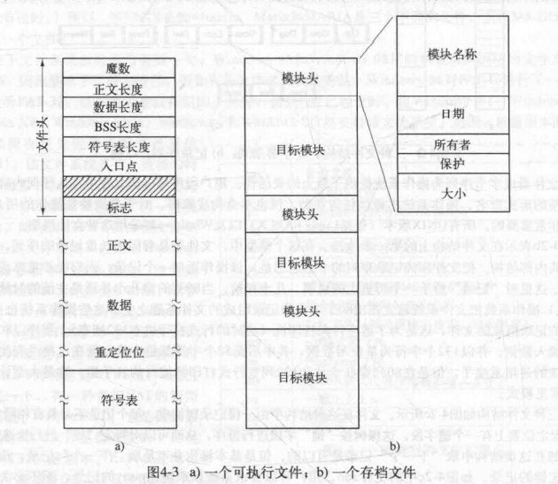
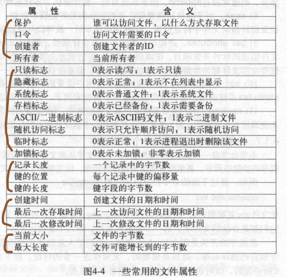

<!-- @import "[TOC]" {cmd="toc" depthFrom=1 depthTo=6 orderedList=false} -->

<!-- code_chunk_output -->

- [1 File](#1-file)
  - [1.1 why:](#11-why)
  - [1.2 扩展名](#12-扩展名)
  - [1.3 文件类型(file types)](#13-文件类型file-types)
    - [1.3.1 普通文件(regular file)](#131-普通文件regular-file)
    - [1.3.2 非普通文件:](#132-非普通文件)
    - [1.3.3 简单的二进制文件:可执行文件 exe & 归档文件(库文件) archive](#133-简单的二进制文件可执行文件-exe-归档文件库文件-archive)
  - [1.4 文件访问方法(access methods)](#14-文件访问方法access-methods)
    - [1.4.1 顺序访问(Sequential access)](#141-顺序访问sequential-access)
    - [1.4.2 随机访问(Random access)](#142-随机访问random-access)
  - [1.5 文件属性](#15-文件属性)
  - [1.6 文件内部结构(File structure)](#16-文件内部结构file-structure)
- [2 Directory](#2-directory)
  - [2.1 单级目录(Single Level Directory)](#21-单级目录single-level-directory)
  - [2.2 二级目录(Tow Level Directory)](#22-二级目录tow-level-directory)
  - [2.3 多级目录(Hierarchical Directory Systems)](#23-多级目录hierarchical-directory-systems)
  - [2.4 目录操作](#24-目录操作)

<!-- /code_chunk_output -->

# 1 File
> 文件系统 = 文件 + 文件管理

## 1.1 why:
* 定位信息
* 安全性需求
* 磁盘块管理
* 考虑突发情况(突然断电等)
* 缓存设计

## 1.2 扩展名
> win注册表维护每每个扩展名支持的程序
> 考虑文件扩展名如何存储

## 1.3 文件类型(file types)
### 1.3.1 普通文件(regular file)
> 看成字节集合
### 1.3.2 非普通文件:
* 目录文件(Directory file)
    > 不能字节操作
* 设备文件(Device file)
    > 对硬件设备的抽象,提供统一的接口
### 1.3.3 简单的二进制文件:可执行文件 exe & 归档文件(库文件) archive

* exe
    * magic number: exe的身份标识(表明这是一个可执行文件)
    * entry point: 标记第一条语句
* 存档文件(archive)
    > 由已编译但未链接的库模块组成(.o?)

## 1.4 文件访问方法(access methods)
### 1.4.1 顺序访问(Sequential access)
> 不能跳过字节访问,如键盘文件
### 1.4.2 随机访问(Random access)
> 可以跳过,如视频文件

## 1.5 文件属性
> 文件属性,又称**元数据**

* 第一部分与文件保护有关
    > 确定文件的访问权限
* 第二部分为标志
    > 是一些控制特殊属性的位和特殊字段
* 第三部分为记录
    > 只出现在用关键字查找记录的文件中,提供查找所需信息
* 第四部分为时间
* 第五部分为大小
## 1.6 文件内部结构(File structure)
> 是逻辑结构,不是物理结构
* byte sequence: 字节序列,由用户程序解释,灵活性高
* record sequence: 由固定长度的记录(块)组成
* Tree: 

# 2 Directory
> 管理成本要远小于收益

## 2.1 单级目录(Single Level Directory)
> 所有用户的文件都存放在根目录下
* 问题: 无法重名,查找困难

## 2.2 二级目录(Tow Level Directory)
> 每个用户有单独的目录

## 2.3 多级目录(Hierarchical Directory Systems)
* 问题: 需要考虑路径,无法快速搜索

## 2.4 目录操作
* readdir 返回打开目录的下一目录项
    > 相比与read读目录,readdir无需考虑目录的内部结构(read需要程序员处理目录内部结构)
* link 多个目录中出现同一文件
    > 增加该文件inode的计数,为硬链接