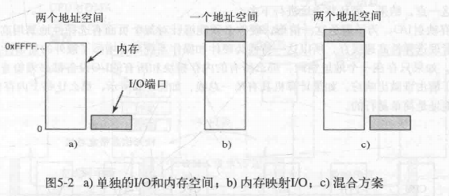

<!-- @import "[TOC]" {cmd="toc" depthFrom=1 depthTo=6 orderedList=false} -->

<!-- code_chunk_output -->

- [1 Principles of IO hardware](#1-principles-of-io-hardware)
  - [1.1 IO设备](#11-io设备)
    - [1.1.1 块设备(block device)](#111-块设备block-device)
    - [1.1.2 字符设备(character device)](#112-字符设备character-device)
  - [1.2 设备控制器(device controller)](#12-设备控制器device-controller)
  - [1.3内存映射IO](#13内存映射io)
    - [1.3.1 单独的IO空间和内存空间](#131-单独的io空间和内存空间)
    - [1.3.2 内存映射IO(memory-mapped IO)](#132-内存映射iomemory-mapped-io)
    - [1.3.3 混合方案](#133-混合方案)
    - [1.3.4 如何工作](#134-如何工作)
  - [1.4 直接存储器读取DMA(Direct Memory Access)](#14-直接存储器读取dmadirect-memory-access)
  - [1.5 中断](#15-中断)
    - [1.5.1 中断向量: 一个记录中断信息的表格](#151-中断向量-一个记录中断信息的表格)
    - [1.5.2 中断发生时,在哪里保存当前状态信息?](#152-中断发生时在哪里保存当前状态信息)
    - [1.5.3 精确中断和不精确中断](#153-精确中断和不精确中断)

<!-- /code_chunk_output -->

# 1 Principles of IO hardware

## 1.1 IO设备
### 1.1.1 块设备(block device)
信息存储在固定大小的块中,传输以块为单位
* 每个块都能独立于其他块读写
### 1.1.2 字符设备(character device)
以字符为单位收发字符流
* 字符设备不可寻址,也没有寻道操作

## 1.2 设备控制器(device controller)
IO设备中的电子部件称作设备控制器或适配器(adapter)
> 控制器的作用是将串行的位流转化为字节块并进行错误校正

## 1.3内存映射IO
每个控制器都有几个**控制寄存器**用与CPU通信,来传递或修改设备状态
设备还可能有操作系统可读写的**数据缓冲区**
> 问题: CPU如何与控制寄存器和数据缓冲区通信?

有两个方法:
### 1.3.1 单独的IO空间和内存空间
每个控制寄存器分配一个IO端口号(IO port),一个8位或16位的整数
所有IO端口形成IO端口空间,受到保护用户态下不可访问

使用 `IN REG,PORT`读取,读取控制寄存器port内容并存于CPU寄存器reg中
使用 `OUT PORT,REG`写入
> 内存地址空间和IO地址空间是不同的`IN R0,4`表示读取IO端口4并存入R0
* 缺点: 需要特殊的IO指令读写,增加了控制IO的开销(必须用汇编)
### 1.3.2 内存映射IO(memory-mapped IO)
将所有控制寄存器映射到内存空间中,每个分配唯一的内存地址
一般分配给控制寄存器的地址靠近地址空间的顶端
* 优点: 
    * 可以将控制寄存器当作内存中变量来寻址,可完全由C实现
    * 不需要特殊的保护机制阻止用户进程的IO操作
        > 操作系统只需避免将包含控制寄存器的地址空间放到用户的虚拟地址空间中
        > 在用户请求访问特定IO设备时,只需将包含该控制寄存器的页面放到页表中即可
        > 不同的设备驱动程序放在不同的地址空间中,可以减小内核大小,防止驱动程序的互相干扰
    * 可以用引用内存的指令引用控制寄存器
* 缺点:
    * 可能会让控制寄存器进行高速缓存(IO设备高速缓存)
        > 解决方法:操作系统需要选择性高速缓存,这额外增加了硬件和操作系统的复杂性
    * 无法良好运行在具有单独的内存总线上的机器(为了提高内存效率)
        > 一种可能的方法是首先将全部内存引用发送到内存,如果内存响应失败,CPU将尝试其他总线。这一设计是可以工作的,但是需要额外的硬件复杂性
        > 第二种可能的设计是在内存总线上放置一个探査设备,放过所有潜在地指向所关注的I/O设备的地址。此处的问题是,IO设备可能无法以内存所能达到的速度处理请求
        > 第三种可能的设计是在内存控制器中对地址进行过滤,在这种情形下,内存控制器芯片中包含在引导时预装载的范围寄存器。例如,640K到1M-1可能被标记为非内存范围。落在标记为非内存的那些范围之内的地址将被转发给设备而不是内存。这一设计的缺点是需要在引导时判定哪些内存地址不是真正的内存地址
### 1.3.3 混合方案
数据缓冲区用内存映射IO,控制寄存器用单独的IO端口

### 1.3.4 如何工作
CPU请求读入时,都将需求地址放在总线的地址线上,然后在总线的一条控制线上置一个READ信号.
如果是统一地址空间(内存映射IO),那会比较请求地址和各内存模块的服务范围,然后对应的响应请求
如果是单独的,就用第二条信号线表明请求的是IO地址空间还是内存空间,然后对应的响应请求

## 1.4 直接存储器读取DMA(Direct Memory Access)
需要硬件的DMA控制器,一般只有一个DMA控制器可利用(主板上)由他调控到多个设备的数据传送
* 普通的磁盘读:
    > 控制器从磁盘驱动器中串行的读将整块信息放到内部缓冲区中,然后进行错误检查.正确时产生一个中断.后操作系统从缓冲区中读取信息存入内存

* **DMA**:
    > 1.信息传递: CPU通过DMA控制器的寄存器来通知将什么数据传送到什么地方
    2.错误检查: DMA控制器命令磁盘控制器读出相应数据到缓冲区并错误检查
    3.请求读: DMA控制器在总线上发出一个读请求到磁盘控制器(为普通的读请求)
    4.写入,判断: 磁盘控制器取出字到内部缓冲区(写入缓冲区是为了给总线请求以缓冲时间),并写入目标地址,后给DMA控制器一个应答信号,DMA控制器通过字节计数有无达到0判断是否停止,如大于0就继续请求读
    如果字节计数到0,DMA控制器就中断CPU告诉CPU传送完成

    > 整个过程无需操作系统参与,信息已经在内存中

    > DMA控制器可以实现多路传送,配备多组寄存器即可
    可以以一字模式和块模式工作,一字模式使用周期窃取,块模式是突发模式(通知设备获得总线然后一连串传送)
    DMA控制器一般使用物理地址传送
    
## 1.5 中断
> IO完成时在总线信号线上产生中断,被主板上的**中断控制芯片**获得,发送给CPU
> 中断信号也是有优先级的,如果中断请求没被响应,就继续在总线上置中断信号直到得到CPU.
### 1.5.1 中断向量: 一个记录中断信息的表格
如果在地址线上收到相应中断向量,就再读取相应PC进入相应中断服务过程.
### 1.5.2 中断发生时,在哪里保存当前状态信息?
* 内部寄存器: 中断控制器在所有相关信息读出前无法应答(以免第二个中断重写寄存器),导致中断时死机
* 用户堆栈: 堆栈指针可能不合法
* 内核堆栈:堆栈指针合法且指向固定页面,但切换核心态会要求MMU改变上下文,而且会使高速缓存和TLB部分失效,浪费CPU时间

### 1.5.3 精确中断和不精确中断
> 流水线CPU可能使每条指令进度不一致
* 精确中断:中断指令之前和之后和本指令的状态都是已知,明确的
* 不精确中断:中断时的PC无法正确反映已执行和未执行的指令间的边界
    > 不仅流水线,超标量计算机的微操作指令甚至可以乱序执行
    > 必须处理将大量内部状态吐到堆栈中让操作系统判断
> 可以让部分种类的中断和陷阱是精确的,部分不精确(如IO中断精确,致命编程错误中断不精确(不需要尝试重新开始))
